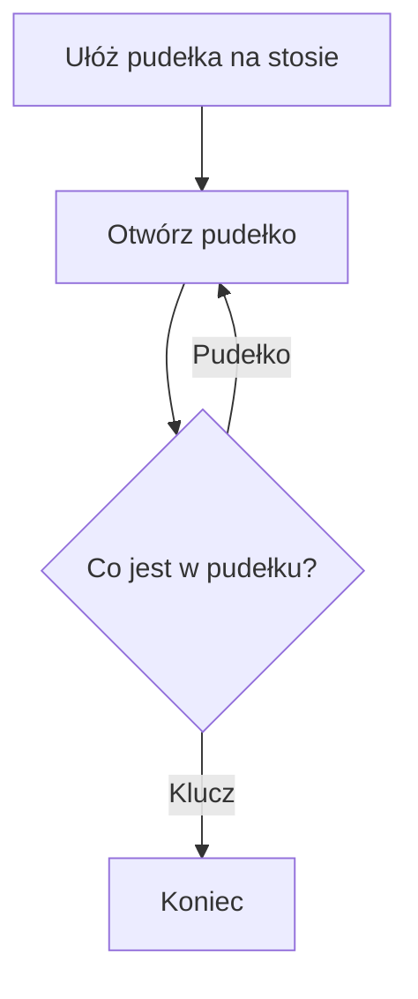

# Rekurencja


Rekurencja, rekursja, (eng. recursion) - odwoływanie się funkcji do samej siebie. 

Rekurencja funkcji składa się z dwóch przypadków:
* przypadek podstawowy (eng. base case)
* przypadek rekurencyjny (eng. recursive case)

Przykład rekurencji dla ciągu Fibonacciego

```python
def fib(n):
    # base case
    if n < 2:
        return n
    # recursive case
    else:
        return fib(n-2) + fib(n-1)
```


Pamiętaj, że rekurencja jest kosztowna pamięciowo.

Przykład rekurencji dla zadania znalezienia klucza gdzieś w pudełkach, które mogą zawierać inne pudełka.



## Rekurencja ogonowa #TODO

Rekurencja ogonowa (eng. *tail call / recursion*) - 

## Derekursywacja

Derekursywacja to przekształcenie algorytmu rekursyjnego w odpowiadający mu algorytm iteracyjny.

Dla przykładu dekursywacją algorytmu na ciągi fibionacciego będzie poniższa funkcja.

```python
def fib(n):
    if n == 0: 
        return n
    last = 0
    next = 1
    
    for _ in range(1, n):
        last, next = next, last + next
    return next
```


