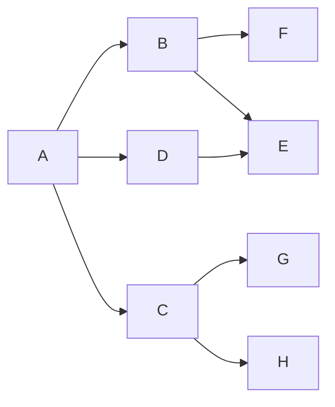

# Wyszukiwanie wszerz


Wyszukanie wszerz (*ang. breadth-first search* BFS) - Najprostrzy algorytm przeszukiwania garfów.

Wykorzystywany do:
- Typ 1: czy istnieje droga z węzła A do węzła B?
- Typ 2: jaka jest najkrótsza droga z węzła A do węzła B?

Przechodzenie grafu rozpoczyna się od wierzchołka s i polega na odwiedzeniu wszystkich osiągalnych z niego wierzchołków (siąsiadów)

Złożoność: $O(|V| + |E|)$, gdzie V - liczba węzłów, a E - liczba krawędziw grafie

Zakładając graf:



Algorytm przeszuka graf na następującej kolejności: **A**, B, D, C, E, F, **G**

```pseudocode
def bfs(graph, src=A, dest=G):
    kolejka := Kolejka()
    odwiedzone := []

    kolejka.enqueue(src)

    while kolejka is not None:
        krawedz = kolejka.dequeue()
        if krawedz == dest:
            return True
        elif krawedz not in odwiedzone:
            kolejka.enqueue(krawedz.wez_sasiadow)
            odwiedzone.add(krawedz)
    return False
```
